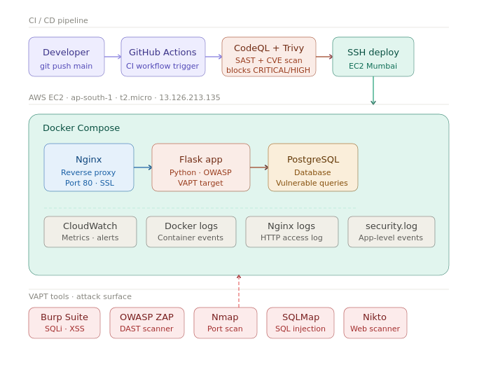
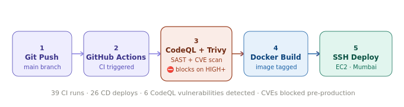
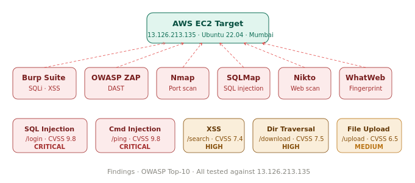

# 🛡️ Enterprise CyberSecurity Lab


---

## 📌 Overview

This project demonstrates a **real-world DevSecOps pipeline** integrating:

- Infrastructure-as-Code automation with Terraform on AWS
- CI/CD with GitHub Actions — security gates at every stage (Shift-Left)
- Intentional OWASP Top-10 vulnerabilities for hands-on VAPT training
- Cloud-native monitoring with CloudWatch, Docker logs, and custom security logging

Built on AWS EC2 (Mumbai region) with a focus on **practical implementation, end-to-end automation, and offensive + defensive security**.

---

## 🏗️ System Architecture



---

## 🔁 CI/CD Pipeline Flow



---

## 🎯 VAPT Attack Surface



---

## ⚙️ Tech Stack

### 🔹 Cloud & Infrastructure
- AWS EC2 (t2.micro · Ubuntu 22.04 · Mumbai `ap-south-1`)
- Terraform — HashiCorp HCL for automated provisioning

### 🔹 CI/CD
- GitHub Actions
- SSH key-based deploy to EC2

### 🔹 Security Scanning (Shift-Left)
- CodeQL → Static Application Security Testing (SAST)
- Trivy → Container CVE scanning — blocks `CRITICAL` / `HIGH`

### 🔹 Containerization
- Docker
- Docker Compose (Flask + PostgreSQL + Nginx)

### 🔹 Application Stack
- Python Flask — intentionally vulnerable VAPT target
- PostgreSQL — vulnerable login queries
- Nginx — reverse proxy, SSL termination, access logging

### 🔹 VAPT Tools
- Burp Suite → SQL injection, XSS interception
- OWASP ZAP → Dynamic application security testing
- SQLMap → Automated SQL injection exploitation
- Nmap → Network discovery, port scanning, OS detection
- Nikto → Web server vulnerability scanning
- WhatWeb → Technology fingerprinting

### 🔹 Monitoring & Logging
- AWS CloudWatch → Metrics and alerting
- Docker Logs → Container event logging
- Nginx Access Logs → HTTP request logging
- Custom `security.log` → IP, method, endpoint, args

---

## 🔐 Security Implementation

✔ Static code analysis (CodeQL SAST) — 6 real vulnerabilities detected  
✔ Container vulnerability scanning (Trivy) — CVEs blocked pre-deployment  
✔ Intentional OWASP Top-10 vulnerabilities for VAPT training  
✔ Secure vs vulnerable endpoint comparison (`/login` vs `/secure-login`)  
✔ Parameterized queries and HTML escaping in secure endpoints  
✔ Cloud-level monitoring with CloudWatch and access logging  
✔ Nginx security headers (X-Frame-Options, X-XSS-Protection, CSP)

---

## 🚀 CI/CD Pipeline Flow

```text
GitHub Push → GitHub Actions → CodeQL SAST → Docker Build → Trivy Scan → SSH Deploy → EC2
```

**Results:** 39 CI runs · 26 CD deploys · 6 SAST vulnerabilities detected · CVEs blocked pre-production

---

## 🎯 VAPT Findings

| Vulnerability | Endpoint | Tool | CVSS | Severity |
|---|---|---|---|---|
| SQL Injection | `/login` | Burp Suite / SQLMap | 9.8 | 🔴 CRITICAL |
| Command Injection | `/ping` | Browser / Curl | 9.8 | 🔴 CRITICAL |
| Cross-Site Scripting | `/search` | Burp Suite | 7.4 | 🟠 HIGH |
| Directory Traversal | `/download` | Browser | 7.5 | 🟠 HIGH |
| Insecure File Upload | `/upload` | Browser | 6.5 | 🟡 MEDIUM |

Target: `13.126.213.135` · AWS EC2 Ubuntu 22.04 · Mumbai region

---

## 📁 Project Structure
